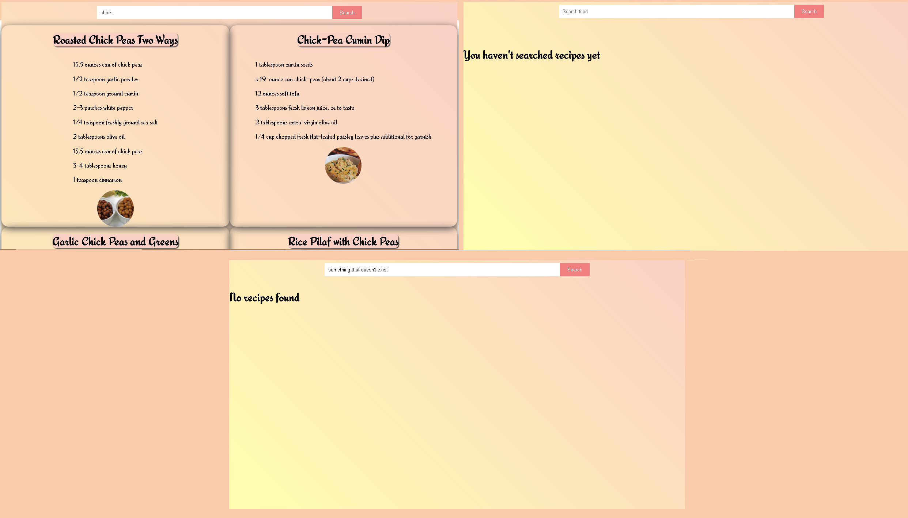

# REACipe

## REACipe is a recipe application made with React.

# Requirements

* [Node & Npm](https://nodejs.org/en/)
* [Git](https://git-scm.com/)
* [Edamam API keys](https://developer.edamam.com/edamam-recipe-api)

# Installation

* `git clone https://github.com/ThiagoBastosN/REACipe.git`
* `cd reacipe`
* `npm install`
* Inside `.env` insert your API_KEY and API_ID values
* `npm run start`

# Usage

The usage is pretty simple. You search for an ingredient type or recipe in the input field
and the API will return to you recipes with the specific keyword you used.

This website uses Edamam recipe API to return the recipes.